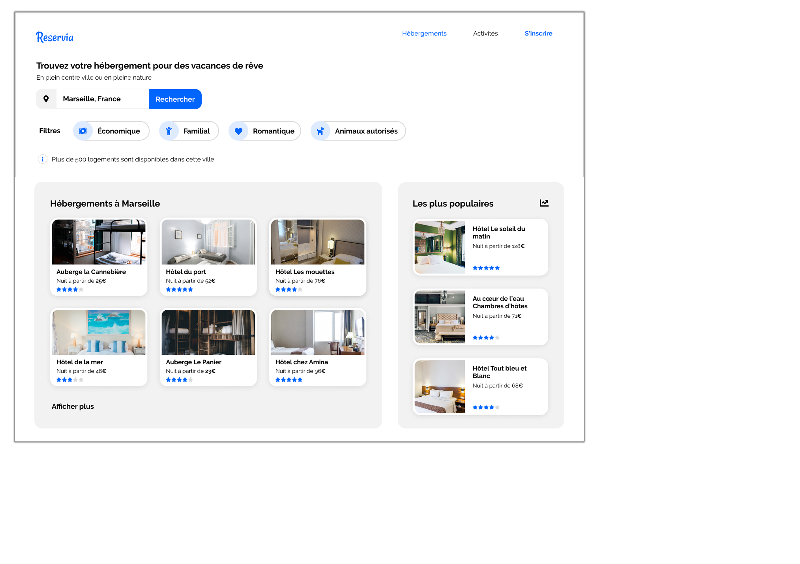

## Reservia booking
### Integration project

### https://githubagneska.github.io/HAgnesGenay_2_19112020/

    

### STACK
- HTML/CSS
-----
---

### TASKS DESCRIPTION
---

#### RESERVIA app:
- trouver des hébergements et des activités dans une ville choisie 
- Les hébergements peuvent être filtrés par thématique (budget, ambiance..)

- design basé sur les principes du Material Design

---

### TASK : intégrer la maquette responsive en HTML et CSS

### Fonctionnalités:
- CHAMP DE RECHERCHE ville éditable, bouton non fonctionnel

- CARTES d’hébergement ou d’activité = cliquables dans leur intégralité. Pour l’instant les liens seront vides

- FILTRES ne seront pas fonctionnels pour cette version, en revanche, il faut qu’ils changent d’apparence au survol => effet au choix

- MENU: les liens “Hébergements” et “Activités” sont des ancres qui doivent mener aux sections de la page.

#### Contraintes techniques:

- RESPONSIVE mobile / dektop = maquettes, tablette : à adapter

- IMAGES : choisir la taille la plus appropriée (résolution/performances)

- ICONES = Font Awesome. 
- COULEURS de la charte:
    + bleu #0065FC + #DEEBFF 
    + gris #F2F2F2 (fond)
- POLICE = Raleway.

- validateur W3C HTML et CSS
- compatible avec les dernières versions de Chrome et Firefox

- versionning Git (repo : Nomcomplet_#_Datedémarrage) + deploy GithubPages
---

